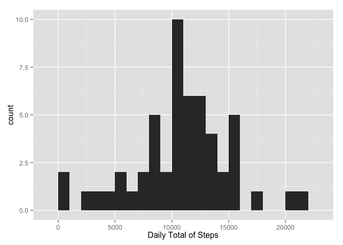
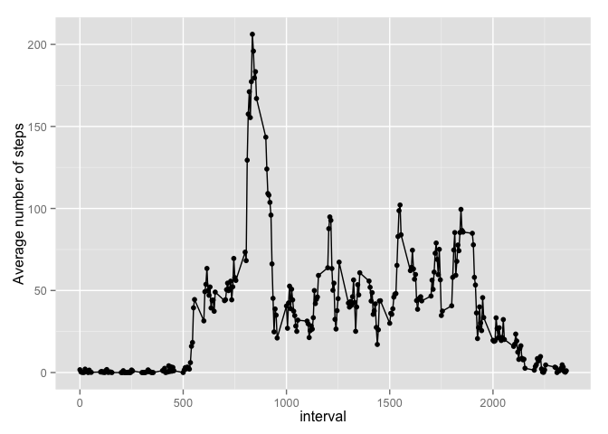
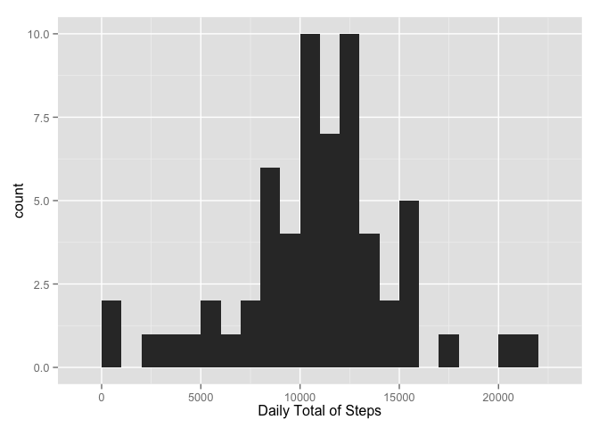
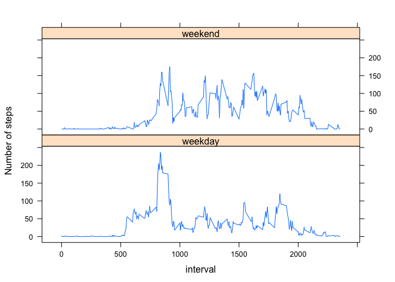

# Reproducible Research: Peer Assessment 1


## Loading and preprocessing the data
This a pretty straight forward unzipping of the data file in the local repository.

```r
unzip("activity.zip")
data <- read.csv("activity.csv")
```

## What is mean total number of steps taken per day?
### 1. A histogram of the total number of steps taken every day.
We use tapply to sum over each day's number of steps. 

```r
library(ggplot2)
daytotals_byday <- tapply(data$steps, data$date, sum, na.rm = F)
qplot(daytotals_byday, binwidth = 1000, xlab = "Daily Total of Steps")
```

 

### 2. Calculating and reporting the mean and median number of steps taken per day.
This is a straight forward calculation.

```r
mean(daytotals_byday, na.rm = T)
```

```
## [1] 10766.19
```

```r
median(daytotals_byday, na.rm = T)
```

```
## [1] 10765
```

## What is the average daily activity pattern?
### 1. Make a time series plot of the 5-minute interval and the average number of steps taken, averaged over all days.
First we need to calculate the averages, using tapply.

```r
means_byinterval <- tapply(data$steps, data$interval, mean, na.rm = T)
```

Now for the plot.

```r
plt <- qplot(as.integer(names(means_byinterval)), means_byinterval, xlab = "interval", ylab = "Average number of steps")
plt + geom_line()
```

 

### 2. The 5-min interval with the highest number of steps on average.

```r
names(which(means_byinterval == max(means_byinterval)))
```

```
## [1] "835"
```

## Imputing missing values
### 1. Calculate and report the total number of missing values in the dataset.
That is again a simple calculation.

```r
sum(is.na(data$steps))
```

```
## [1] 2304
```

### 2. Devise a strategy for filling in the missing data.

One very reasonable idea is to fill in the missing data with interval averages. 
But I want to go a step further and fill in interval averages as determined by weekday.
The logic is that at a given time interval on a Monday, one is more likely to be doing
a similar activity to what they were doing on another Monday than on a Sunday for example.

First, we add a column of weekdays to the data.

```r
data$weekday <- as.factor(sapply(as.Date(data$date), weekdays))
```

Next, we split the data by weekday and calculate averages for each interval.

```r
split_data <- split(data, data$weekday)
mean_bywkday <- lapply(split_data, function(x) {tapply(x$steps, x$interval, mean, na.rm = T)})
```

Now we loop over the dataset and substitute the NAs with the appropriate averages.

```r
data_adj <- data
for(i in seq_along(data_adj$steps)) {
        if(is.na(data_adj$steps[[i]])) {
                data_adj$steps[[i]]<-mean_bywkday[[data_adj$weekday[[i]]]][[as.character(data_adj$interval[[i]])]]
        }
}
```

Here are the new daytotals and their histogram plot.

```r
daytotals_byday2 <- tapply(data_adj$steps, data_adj$date, sum, na.rm = T)
qplot(daytotals_byday2, binwidth = 1000, xlab = "Daily Total of Steps")
```

 

Finally, we check the adjusted mean and median.

```r
mean(daytotals_byday2)
```

```
## [1] 10821.21
```

```r
median(daytotals_byday2)
```

```
## [1] 11015
```

We see that they are a bit higher than the numbers from the original dataset with
NAs omitted. The effect is also clear on the histogram - the added days are just above the mean of the distribution.

## Are there differences in activity patterns between weekdays and weekends?
### 1. Create a new factor variable with two levels - "weekday" and "weekend".
First, we set up a function to assign the proper factor.

```r
weekend <- function(x) {
        if(x == "Saturday"|x == "Sunday") {
                as.factor("weekend")
        } else as.factor("weekday")
}
```

Here we loop inside the dataframe and create the new column. 

```r
data_adj$weekend <- sapply(data_adj$weekday, weekend)
```

### 2. Make a panel time series plot of the average steps over the 5-minute intervals, accross all weekdays and all weekend days.
For the calculation we use the data.table format with tapply.

```r
library(data.table)
DT_adj <- data.table(data_adj)
DT_mean <- DT_adj[, tapply(steps, interval, function(x) mean(x)) ,by=weekend]
```

Now we go back to a dataframe and make sure we have all the necessary columns.

```r
df_mean <- data.frame(DT_mean)
intervals <- unique(data_adj$interval)
df_mean$interval <- intervals
```

Finally, the lattice plot:

```r
library(lattice)
xyplot(V1 ~ interval|weekend, data = df_mean, type = "l", layout = c(1,2), ylab = "Number of steps")
```

 
